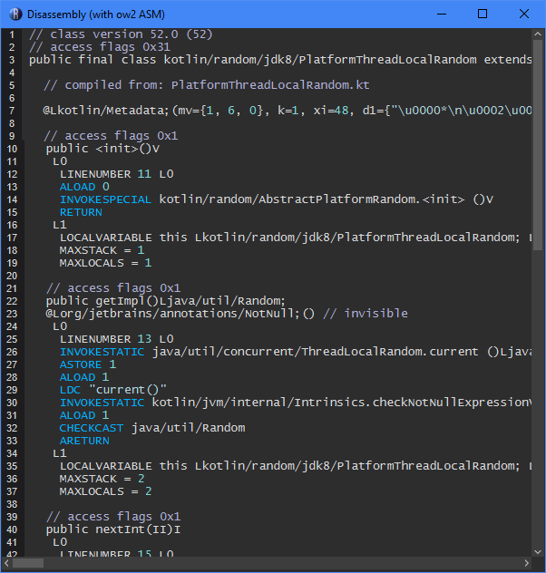
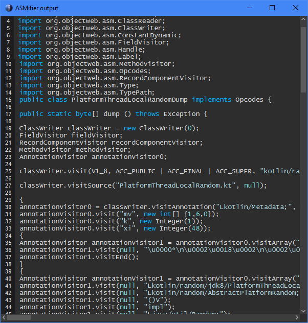
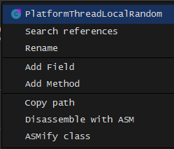

# recaf-asm-export
Simple [Recaf](https://github.com/Col-E/Recaf) plugin to also add the ability to export as ASM bytecode, or as ASM java code (the code to write the given class in java with ASM).
Exceptionally useful when reverse-engineering (obfuscated) JVM bytecode.  
I personally prefer this over the built-in editor because it is more consistent and clear, but this is mostly personal preference.

